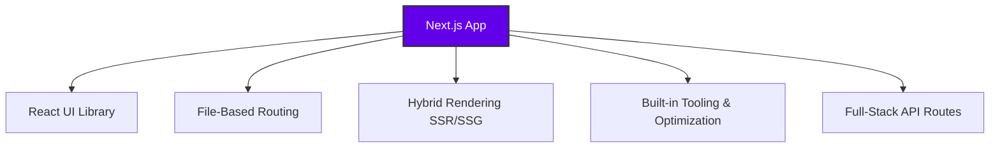

# 🚀 Next.js: The Full-Stack React Framework

Welcome to the ultimate guide on **Next.js**. If you love building user interfaces with React but dread the complex configuration required for production-ready apps, Next.js is your solution.

---

## 🛠️ What is Next.js?

**Next.js** is a powerful, flexible React framework designed for building full-stack web applications. Instead of forcing you to piece together separate libraries for routing, styling, and server handling, Next.js packages everything you need into a single, cohesive ecosystem.



It runs directly on top of React and automatically upgrades your development experience by adding:

* 🗺️ **Routing:** Dynamic, file-system-based routing without `react-router-dom`.
* ⚡ **Rendering:** Server-Side Rendering (SSR) and Static Site Generation (SSG) out of the box.
* 🔌 **API Routes:** Easily build serverless backend endpoints right inside your frontend project.
* 📦 **Build & Dev Tooling:** Zero-config compilation, bundling, and hot-reloading powered by Rust-based tooling.

> 💡 **The Golden Rule:** > **React** is a UI Library (the bricks). **Next.js** is the complete architecture framework (the entire house).

---

## ⚖️ Why Use a Framework? (The Ultimate Showdown)

Building a modern web app without a framework can feel like reinventing the wheel. Here is how using Next.js changes the game:

### 🟥 Without a Framework (Vanilla React + Bundler)

* **Manual Heavy Lifting:** You must manually configure routing, code-splitting, and asset optimization.
* **Configuration Fatigue:** Countless hours spent tweaking configuration files (Vite, Webpack, Babel).
* **SEO & Performance Hurdles:** Client-Side Rendering (CSR) means slower initial page loads and poor search engine indexability.
* **Split Architecture:** Your backend Node server must live in an entirely separate repository and deployment pipeline.

### 🟩 With Next.js (Framework Advantage)

* **Batteries Included:** Routing, server rendering, and production builds are ready instantly.
* **Sensible Defaults:** Spend your energy writing feature code rather than wrestling with build configs.
* **Performance by Default:** Built-in advanced optimizations for images, fonts, scripts, and layout shifts.
* **Unified Codebase:** Frontend and optional backend API routes live harmoniously in one single repository.

---

## 🎯 When is Next.js a Good Fit?

Next.js is the industry standard for a reason, but it shines brightest in these specific scenarios:

1. **SEO & Speed are Priorities:** If your site relies on organic search traffic (E-commerce, Blogs, Marketing pages), Next.js's **SSR** and **SSG** ensure search engine crawlers read your content perfectly.
2. **File-Based Architecture:** You prefer an intuitive directory structure where creating a folder automatically creates a clean URL web route.
3. **True Full-Stack Monoliths:** You want a lightweight backend to handle form submissions, database lookups, or webhooks without managing an independent server.
4. **Ecosystem & Scaling:** You want access to world-class documentation, global edge deployments (like Vercel), and an enormous, highly active developer community.

---

## 🚀 Getting Started

### Installation

To create a new Next.js application, run the following command in your terminal:

```bash
npx create-next-app@latest

```

Follow the interactive prompts to set up your project preferences (TypeScript, ESLint, Tailwind CSS, etc.).

### Writing Your First "Hello World"

In Next.js (App Router), pages are created inside the `app/` directory.

1. Open `app/page.js` (or create it if it doesn't exist).
2. Add the following code:

```javascript
export default function Home() {
  return (
    <main style={{ padding: '2rem', textAlign: 'center' }}>
      <h1>🚀 Hello World from Next.js!</h1>
      <p>Welcome to your brand new full-stack application.</p>
    </main>
  );
}

```

---

## 🗺️ Understanding Routing in Next.js

### What is the Router?

The router connects the address in the browser (URL) to what the user sees on the screen. In Next.js, you don't configure routes in a large, manual JavaScript list. Instead:

* You create folders and files in your project directory.
* Next.js automatically reads that structure and turns it into routes.
* **The Formula:** `Folder` + `Special page.js file` = `One accessible web route`.

When a user clicks a link, Next.js uses the `<Link>` component (and sometimes the `useRouter` hook) to change the page instantly without a full browser reload.

---

## ⚔️ App Router vs. Pages Router

Next.js offers two distinct systems for defining routes. While both are file-system based, they function differently:

| Feature | App Router (Recommended) 🟩 | Pages Router (Legacy) 🟥 |
| --- | --- | --- |
| **Root Directory** | `app/` | `pages/` |
| **Route Creation** | Folder name defines the URL. Requires a `page.js` inside it. | File name directly defines the URL (e.g., `about.js`). |
| **Layouts** | Native support via `layout.js` inside any folder. | Requires manual configuration inside a custom `_app.js`. |
| **Homepage URL** | `app/page.js` $\rightarrow$ `/` | `pages/index.js` $\rightarrow$ `/` |

### Which One Should I Choose?

* **For New Projects:** Always choose the **App Router**. This is the modern, recommended standard where all new Next.js features and optimizations are actively developed.
* **For Existing Projects:** The **Pages Router** is still fully supported for backwards compatibility, but migrating to the App Router is recommended over time.

---

## 🔄 Next.js vs. Vanilla React

Is React not enough? **Next.js is not a replacement for React; it is built on top of it.** React provides the UI toolkit, while Next.js provides the complete structural architecture.

| Feature | React (UI Library) ⚛️ | Next.js (Full-Stack Framework) 🚀 |
| --- | --- | --- |
| **Core Focus** | UI Components & state management | Complete production-ready application architecture |
| **Routing** | Requires external libraries (e.g., `react-router-dom`) | Built-in, automated file-system routing |
| **Rendering** | Client-Side Rendering (CSR) by default | Hybrid: SSR, SSG, ISR, and CSR |
| **Backend Support** | Requires a completely separate backend server | Native API routes for built-in serverless execution |
| **Best For** | Learning UI concepts, single-page apps (SPAs) | Scalable production apps, startups, e-commerce |

