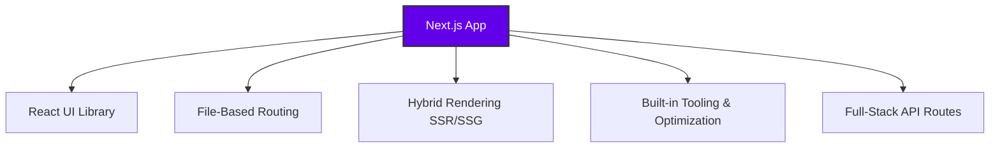

# 🚀 Next.js: The Full-Stack React Framework

Welcome to the ultimate guide on **Next.js**. If you love building user interfaces with React but dread the complex configuration required for production-ready apps, Next.js is your solution.

---

## 🛠️ What is Next.js?

**Next.js** is a powerful, flexible React framework designed for building full-stack web applications. Instead of forcing you to piece together separate libraries for routing, styling, and server handling, Next.js packages everything you need into a single, cohesive ecosystem.

It runs directly on top of React and automatically upgrades your development experience by adding:

- 🗺️ **Routing:** Dynamic, file-system-based routing without `react-router-dom`.
- ⚡ **Rendering:** Server-Side Rendering (SSR) and Static Site Generation (SSG) out of the box.
- 🔌 **API Routes:** Easily build serverless backend endpoints right inside your frontend project.
- 📦 **Build & Dev Tooling:** Zero-config compilation, bundling, and hot-reloading powered by Rust-based tooling.

> 💡 **The Golden Rule:** > **React** is a UI Library (the bricks). **Next.js** is the complete architecture framework (the entire house).

---

## ⚖️ Why Use a Framework? (The Ultimate Showdown)

Building a modern web app without a framework can feel like reinventing the wheel. Here is how using Next.js changes the game:

### 🟥 Without a Framework (Vanilla React + Bundler)

- **Manual Heavy Lifting:** You must manually configure routing, code-splitting, and asset optimization.
- **Configuration Fatigue:** Countless hours spent tweaking configuration files (Vite, Webpack, Babel).
- **SEO & Performance Hurdles:** Client-Side Rendering (CSR) means slower initial page loads and poor search engine indexability.
- **Split Architecture:** Your backend node server must live in an entirely separate repository and deployment pipeline.

### 🟩 With Next.js (Framework Advantage)

- **Batteries Included:** Routing, server rendering, and production builds are ready instantly.
- **Sensible Defaults:** Spend your energy writing feature code rather than wrestling with build configs.
- **Performance by Default:** Built-in advanced optimizations for images, fonts, scripts, and layout shifts.
- **Unified Codebase:** Frontend and optional backend API routes live harmoniously in one single repository.

---

## 🎯 When is Next.js a Good Fit?

Next.js is the industry standard for a reason, but it shines brightest in these specific scenarios:

1. **SEO & Speed are Priorities:** If your site relies on organic search traffic (E-commerce, Blogs, Marketing pages), Next.js's **SSR** and **SSG** ensure search engine crawlers read your content perfectly.
2. **File-Based Architecture:** You prefer an intuitive directory structure where creating a folder automatically creates a clean URL web route.
3. **True Full-Stack Monoliths:** You want a lightweight backend to handle form submissions, database lookups, or webhooks without managing an independent server.
4. **Ecosystem & Scaling:** You want access to world-class documentation, global edge deployments (like Vercel), and an enormous, highly active developer community.

# Installation & Writing Your First Hello World in Next.js